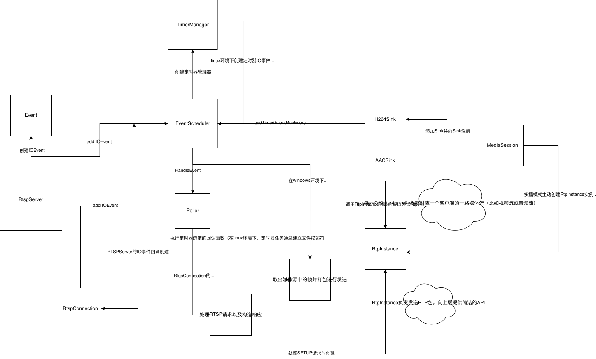

# RTSP Server

一个基于C++实现的轻量级RTSP服务器，支持H264和AAC媒体流传输，支持单播和多播模式。

## 项目概述

本项目是一个功能完整的RTSP服务器，支持实时音视频流的传输。它采用模块化设计，具有良好的扩展性和可维护性，适用于视频监控、直播、音视频点播等场景。

## 功能特性

### 核心功能
- ✅ 支持RTSP协议标准
- ✅ 支持H264视频流传输
- ✅ 支持AAC音频流传输
- ✅ 支持单播（Unicast）传输模式
- ✅ 支持多播（Multicast）传输模式
- ✅ 支持UDP和TCP两种传输协议
- ✅ 支持RTP/RTCP协议

## 技术架构


### 系统架构


### 核心模块

1. **Live模块**：处理音视频媒体流相关功能
   - MediaSession：媒体会话管理
   - MediaSource：媒体源管理（H264/AAC）
   - RtpInstance：RTP协议实现
   - Sink：媒体流输出

2. **Scheduler模块**：处理事件调度和网络通信
   - EventScheduler：事件调度器
   - Event：事件管理
   - Poller/SelectPoller：I/O多路复用
   - SocketsOps：基本套接字操作
   - ThreadPool：线程池

3. **Base模块**：基础工具类
   - Log：日志系统

## 安装与配置

### 获取代码

```bash
git clone <repository-url>
cd RTSPServer
```

### 编译项目

#### Linux环境

```bash
chmod +x ./autobuild.sh
./autobuild.sh
```

## 使用方法

### 启动服务器

```bash
./bin/rtspserver
```

### 客户端访问

1. 基于TCP传输模式

    `ffplay -i -rtsp_transport tcp  rtsp://<server-ip>:1234/test`
2. 基于UDP传输模式

    `ffplay -i rtsp://<server-ip>:1234/test`
3. 多播

    `ffplay -i -rtsp_transport udp_multicast rtsp://<server-ip>:1234/test`

### 多播模式

服务器默认不启用多播功能，需要在`main`文件中手动修改代码，去掉`session->startMulticast();` 重新编译就可以启动多播模式


## 项目结构

```
RTSPServer/
├── Base/              # 基础工具类
│   └── Log.h
├── Live/              # 媒体流相关模块
│   ├── AACFileMediaSource.cpp
│   ├── AACFileMediaSource.h
│   ├── AACFileSink.cpp
│   ├── AACFileSink.h
│   ├── Buffer.cpp
│   ├── Buffer.h
│   ├── H264FileMediaSource.cpp
│   ├── H264FileMediaSource.h
│   ├── H264FileSink.cpp
│   ├── H264FileSink.h
│   ├── InetAddress.cpp
│   ├── InetAddress.h
│   ├── MediaSession.cpp
│   ├── MediaSession.h
│   ├── MediaSessionManager.cpp
│   ├── MediaSessionManager.h
│   ├── MediaSource.cpp
│   ├── MediaSource.h
│   ├── Rtp.cpp
│   ├── Rtp.h
│   ├── RtpInstance.cpp
│   ├── RtpInstance.h
│   ├── RtspConnection.cpp
│   ├── RtspConnection.h
│   ├── RtspServer.cpp
│   ├── RtspServer.h
│   ├── Sink.cpp
│   ├── Sink.h
│   ├── TcpConnection.cpp
│   ├── TcpConnection.h
│   ├── Timer.cpp
│   └── Timer.h
├── Scheduler/         # 事件调度与网络通信
│   ├── Event.cpp
│   ├── Event.h
│   ├── EventScheduler.cpp
│   ├── EventScheduler.h
│   ├── Poller.cpp
│   ├── Poller.h
│   ├── SelectPoller.cpp
│   ├── SelectPoller.h
│   ├── SocketsOps.cpp
│   ├── SocketsOps.h
│   ├── Thread.cpp
│   ├── Thread.h
│   ├── ThreadPool.cpp
│   ├── ThreadPool.h
│   ├── UsageEnvironment.cpp
│   └── UsageEnvironment.h
├── CMakeLists.txt     # CMake配置文件
├── autobuild.sh       # 自动构建脚本
├── main.cpp           # 主函数入口
└── README.md          # 项目说明文档
```


## 知识点记录

### RTSP服务器


#### RTSP请求解析

##### DESCRIBE响应解析

```c++
bool RTSPServer::HandleDESCRIBE(char* sendBuf, const int CSeq, const char* url){
    char sdp[500]; //SDP
    char localIp[100];
    sscanf(url, "rtsp://%[^:]:", localIp);
    sprintf(sdp, "v=0\r\n"
        "o=- 9%ld 1 IN IP4 %s\r\n"
        "t=0 0\r\n"
        "a=control:*\r\n"
        "m=video 0 RTP/AVP 96\r\n"
        "a=rtpmap:96 H264/90000\r\n"
        "a=control:track0\r\n",
        time(NULL), localIp);
    sprintf(sendBuf, "RTSP/1.0 200 OK\r\n"
        "CSeq: %d\r\n"
        "Content-Base: %s\r\n"
        "Content-type: application/sdp\r\n"
        "Content-length: %ld\r\n\r\n"
        "%s",
        CSeq, 
        url,
        strlen(sdp),
        sdp);
    return true;
}
```

`Content-Base: %s`

- **含义**: 内容基准URL。
- **作用**: 它为SDP内容中的**相对URL**提供了一个基础路径。在下面的SDP中，你会看到 `a=control:track0`，这是一个相对路径。客户端会把 `Content-Base` 的值（即完整的请求URL）和 `track0` 拼接起来，形成一个完整的URL（例如 `rtsp://192.168.1.10/track0`）。后续的 `SETUP` 请求就会发往这个拼接后的URL。

```c++
sprintf(sdp, "v=0\r\n"
    "o=- 9%ld 1 IN IP4 %s\r\n"
    "t=0 0\r\n"
    "a=control:*\r\n"
    "m=video 0 RTP/AVP 96\r\n"
    "a=rtpmap:96 H264/90000\r\n"
    "a=control:track0\r\n",
    time(NULL), localIp);
```

`v=0`

- **含义**: **协议版本 (Protocol Version)**。目前SDP的版本就是0。

`o=- 9%ld 1 IN IP4 %s`

- **含义**: **所有者/创建者和会话标识符 (Owner/Creator and Session Identifier)**。
- `o`: 代表 "owner"。
- `-`: 用户名 (这里未使用)。
- `9%ld`: 会话ID，代码中用当前时间戳生成，用于唯一标识一个会话。
- `1`: 会话版本，如果会话信息发生改变，版本号会增加。
- `IN IP4 %s`: 网络类型为 `IN` (Internet)，地址类型为 `IP4` (IPv4)，地址是服务器的IP地址 (`localIp`)。
- **总结**: 这行提供了会话的唯一标识信息。

`t=0 0`

- **含义**: **会话活动时间 (Time the session is active)**。
- `t=0 0` 表示这个会话没有预设的开始和结束时间，即**永久有效**。对于直播或点播流媒体来说，这是标准设置。

`a=control:*`

- **含义**: **会话级控制属性 (Session-level Control Attribute)**。
- `*` 表示对整个会话的控制请求（例如 `TEARDOWN`）可以发送到 `Content-Base` 指定的URL。

`m=video 0 RTP/AVP 96`

- **含义**: **媒体描述 (Media Description)**。这是最核心的行之一。
- `m`: 代表 "media"。
- `video`: 媒体类型是**视频**。
- `0`: 传输端口。在这里写 `0` 是一个占位符，因为在RTSP中，实际的传输端口是在后续的 `SETUP` 命令中由客户端指定的。
- `RTP/AVP`: 传输协议。表示使用 **RTP** (实时传输协议) 和 **AVP** (音视频配置文件)，通常意味着通过UDP传输。
- `96`: **负载类型 (Payload Type)**。这是一个数字标识，范围 96-127 是为动态负载类型保留的。它像一个**标签**，将这一行与下面的 `rtpmap` 属性关联起来，下面那行会解释96的含义

`a=rtpmap:96 H264/90000`

- **含义**: **负载类型映射 (RTP Map Attribute)**。
- `a=rtpmap`: 表示这是一个RTP映射属性。
- `96`: 对应上面 `m=` 行的负载类型标签。
- `H264`: **编码格式**。这行明确告诉客户端，负载类型为96的数据流是 **H.264** 编码的视频。
- `90000`: **时钟频率 (Clock Rate)**。H.264视频流标准时钟频率是90000Hz，用于计算RTP包的时间戳，对同步播放至关重要。

`a=control:track0`

- **含义**: **媒体级控制属性 (Media-level Control Attribute)**。
- 这指定了控制**这个特定视频轨道**的URL。
- `track0` 是一个相对路径，客户端会将其与 `Content-Base` 结合，形成 `rtsp://<server_ip>/track0`。下一步，客户端就会向这个地址发送 `SETUP` 请求，来建立视频流的传输通道。

##### PLAY响应解析

```c++
sprintf(result, "RTSP/1.0 200 OK\r\n"
    "CSeq: %d\r\n"
    "Range: npt=0.000-\r\n"
    "Session: 66334873; timeout=10\r\n\r\n",
    cseq);
```

`Range: npt=0.000-`

- **含义**: 播放范围 (Range)。
- **作用**: 这是`PLAY`响应中一个非常重要的头。它告诉客户端媒体将从哪个时间点开始播放。
- `npt`: 代表 **"Normal Play Time" (正常播放时间)**，通常单位是秒。这是一种表示媒体绝对时间线的方式。
- `0.000-`: 表示从**第0秒（即媒体的开头）开始播放**，一直播放到**流的结束**（末尾的 `-` 代表不设定的结束点）。
- **场景**: 如果客户端想要从视频的第30秒开始播放（拖动进度条），它可以在`PLAY`请求中加入`Range: npt=30.0-`。服务器如果支持，就会在响应中确认这个范围，并从第30秒开始传输数据。

`Session: 66334873; timeout=10`

- **含义**: 会话信息 (Session)。
- **作用**: 这个头用于标识和管理当前的流媒体会话。
- `66334873`: 这是**会话ID**。这个ID是在客户端发送`SETUP`请求后，由服务器创建并返回给客户端的。之后，客户端在每次发送`PLAY`, `PAUSE`, `TEARDOWN`等命令时都必须带上这个ID，服务器则通过这个ID来识别是哪个会话。

#### RTP头定义

```c++
 /*
  *    0                   1                   2                   3
  *    7 6 5 4 3 2 1 0|7 6 5 4 3 2 1 0|7 6 5 4 3 2 1 0|7 6 5 4 3 2 1 0
  *   +-+-+-+-+-+-+-+-+-+-+-+-+-+-+-+-+-+-+-+-+-+-+-+-+-+-+-+-+-+-+-+-+
  *   |V=2|P|X|  CC   |M|     PT      |       sequence number         |
  *   +-+-+-+-+-+-+-+-+-+-+-+-+-+-+-+-+-+-+-+-+-+-+-+-+-+-+-+-+-+-+-+-+
  *   |                           timestamp                           |
  *   +-+-+-+-+-+-+-+-+-+-+-+-+-+-+-+-+-+-+-+-+-+-+-+-+-+-+-+-+-+-+-+-+
  *   |           synchronization source (SSRC) identifier            |
  *   +=+=+=+=+=+=+=+=+=+=+=+=+=+=+=+=+=+=+=+=+=+=+=+=+=+=+=+=+=+=+=+=+
  *   |            contributing source (CSRC) identifiers             |
  *   :                             ....                              :
  *   +-+-+-+-+-+-+-+-+-+-+-+-+-+-+-+-+-+-+-+-+-+-+-+-+-+-+-+-+-+-+-+-+
  *
  */
/*定义方式1，按照位域方式定义*/
struct RtpHeader{
    /*byte 0*/
    uint8_t csrcLen : 4;        // csrc计数器
    uint8_t extension : 1;      // 是否有扩展报头
    uint8_t padding : 1;        // 填充标志，用于包对齐
    uint8_t version : 2;        // RTP协议版本号 当前版本号为2
    /*byte 1*/
    uint8_t payLoadType : 7;    // 有效载荷类型，如GSM音频 JPEM图像
    uint8_t marker : 1;         // 最后一个分片位，标记位，用来指示一帧视频的结束
    /*byte 2-3*/
    uint16_t seq;               // 序列号,每发送一个序列号+1
    /*byte 4-7*/
    uint32_t timestamp;         // 时间戳，接受者用来计算延迟和延迟抖动
    /*byte 8-11*/
    uint32_t ssrc;              // 同步信源标识符
    /*
        标准RTP Header存在0-15个特约信源csrc标识符
        每个csrc标识符占32位，可以有0-15个。
    */
};

/*定义方式2，不按照位域定义，手动对字节进行赋值*/
#pragma pack(push, 1) //来确保编译器不会添加任何填充字节
struct RtpHeader{
    //byte_0 version, padding, extension, csrcLen
    uint8_t firstByte;
    //byte_1 marker, payLoadType
    uint8_t secondByte;
    
    uint16_t seq;
    uint32_t timestamp;
    uint32_t ssrc;
};
#pragma pack(pop) //恢复默认的对齐方式
```

**位域定义：** 通过这种方式来定义结构体，在对单字节的特定位进行赋值的时，可以直接对成员进行赋值，填充的到字节的什么位置完全由编译器进行，**代码当前的定义方式，就是默认编译器是从低字节开始填充，也就是说我们定义的顺序，就是填充的顺序**，当我们给`version`直接赋值2，那么编译器就会自然将高2位填充为2。这也就导致了不确定性，因为不是所有的编译器都是从低位开始填充的，对于从高位开始填充的编译器，那么`version` 就会被填充到低2位，这就会导致接收端如果按照协议就无法正确解析RTP包。

**手动定义：** 就是在赋值阶段，不是直接把值赋值给结构体中的成员，而是手动排列该值在单字节中的位置。例如`rtpPacket->rtpHeader.firstByte = (version<<6) | (padding<<5) | (extension<<4) | csrclen;`  因为在代码的具体实现中，是直接发送结构体的内存的，所以需要确保编译器不会添加任何填充字节（填充了就匹配不上协议了），需要添加`#pragma pack(push, 1)`和`#pragma pack(pop)` 对。还有一种方式，就是 **“手动序列化法”**，不管结构体是否有填充，在发送前自己手动重新构造一个纯净的缓冲区（没有包含任何填充字符，完美符合协议的字节流），然后进行发送，这种方法会更加专业和可靠。

**视频卡顿的原因：**

1. **RTP包发送时间不精确**，一个视频帧(Frame) 可能由一个或多个NALU组成。**当前代码的逻辑**是每发送一个NALU就等待40ms，而正确的逻辑应该是发送完一整帧的所有NALU后，再等待40ms。
2. **RTP包头中有一个“Marker bit”（M位）**，它的作用是向客户端标记一个数据单元的结束。在视频流中，它应该在一帧的最后一个RTP包上被设置为 `1`。**当前的代码逻辑**中，marker初始化为0，之后就没有修改过，客户端只能依赖时间戳的变化。
3. **H264文件读取逻辑**不健壮，**当前的代码逻辑中**，它每次都读取一个固定大小的块 (`FRAME_BUFFER_SIZE`)。如果一个NALU本身就超过了这个大小，您的解析就会出错，导致发送一个不完整的NALU。

#### H264分片封包

```c++
   0                   1                   2                   3
   0 1 2 3 4 5 6 7 8 9 0 1 2 3 4 5 6 7 8 9 0 1 2 3 4 5 6 7 8 9 0 1
  +-+-+-+-+-+-+-+-+-+-+-+-+-+-+-+-+-+-+-+-+-+-+-+-+-+-+-+-+-+-+-+-+
  | FU indicator  |   FU header   |                               |
  +-+-+-+-+-+-+-+-+-+-+-+-+-+-+-+-+                               |
  |                                                               |
  |                         FU payload                            |
  |                                                               |
  |                               +-+-+-+-+-+-+-+-+-+-+-+-+-+-+-+-+
  |                               :...OPTIONAL RTP padding        |
  +-+-+-+-+-+-+-+-+-+-+-+-+-+-+-+-+-+-+-+-+-+-+-+-+-+-+-+-+-+-+-+-+

```

与单一封包不一样的是，**|F|NRI|type|** 变成了 **|FU indicator|FU header|**。其实，**|FU indicator|** 就是 **|F|NRI|type|**，**|F|NRI|type|** 中的 type 如表所示

| 序号 | 类型   | 解释             |
| ---- | ------ | ---------------- |
| 24   | STAP-A | 单一时间的组合包 |
| 25   | STAP-B | 单一时间的组合包 |
| 26   | MTAP16 | 多个时间的组合包 |
| 27   | MTAP24 | 多个时间的组合包 |
| 28   | FU-A   | 分片的单元       |
| 29   | FU-B   | 分片的单元       |

额外增加了**|FU header|**用于标识当前分片的状态，如下所示：

```c+
  +---------------+
  |0|1|2|3|4|5|6|7|
  +-+-+-+-+-+-+-+-+
  |S|E|R|  Type   |
  +---------------+
```

- S，为1表示分片的开始；
- E，为1表示分片的结束；
- R，保留位；
- Type就是NALU头中的Type，取1-23值。

#### AAC封装成RTP包

RTP负载常用的有两种方式，第一种是 单个NAL单元封包(Single NAL Unit Packet)；第二种是 分片单元(Fragmentation Unit) 。因为一帧ADTS帧一般小于 MTU(网络最大传输单元1500字节)，所以对于AAC的RTP封包只需要采用 单个NAL单元封包(Single NAL Unit Packet) 即可。

但并不是直接将 **ADTS 帧去掉ADTS头之后的数据** 作为RTP负载，AAC的RTP负载最开始有4个字节，用来描述负载中包含了多少音频帧以及每一帧的大小，其基本结构如下

- **AU-headers-length (16位)**: 首先是一个16位的字段，它指明了紧随其后的所有 “AU-Header” 的总长度（以比特 bit 为单位）(不是AU-Header的个数，是长度！！1个AU-Header有16bit长)。

- **AU-Header(s) (可变长)**: 接着是一个或多个 “AU-Header”。每个 AU-Header 描述一帧音频，它由两部分组成：

  - **AU-size (可变长)**: 当前音频帧的长度。它的位数由SDP中的`sizelength`参数决定（在这里是13位）。

  - **AU-index (可变长)**: 当前音频帧的索引。它的位数由SDP中的 `indexlength` 参数决定（在这里是3位）。

    ```c++
    /*代码中服务器返回的简易SDP构造*/
    sprintf(sdp, "v=0\r\n"
        "o=- 9%ld 1 IN IP4 %s\r\n"
        "t=0 0\r\n"
        "a=control:*\r\n"
        "m=audio 0 RTP/AVP 97\r\n"
        "a=rtpmap:97 mpeg4-generic/44100/2\r\n"
        //定义ADTS头的格式，客户端可以立即配置好解码器，无需等待解析第一个音视频
        "a=fmtp:97 profile-level-id=1;mode=AAC-hbr;sizelength=13;indexlength=3;indexdeltalength=3;config=1240;\r\n"
    
        //"a=fmtp:97 SizeLength=13;\r\n"
        "a=control:track0\r\n",
        time(NULL), localIp);
    ```

  在这个场景下，RTP包中只有一个音频帧，所以只有一个“AU-Header”，因此“AU-Header”的长度为16bit（13bit+3bit）。如下图所示：


#### 基于TCP同时传输H264和AAC

1. Desrcibe请求返回的SDP中，要同时包含音频流信息和视频流信息。
2. SETUP请求不需要RTP和RTCP的UDP连接通道，因为TCP版的RTP传输，都是使用同一个TCP连接通道，所以发送RTP数据和RTCP数据包时，需要加一些分隔符。且SETUP请求和响应都没有端口号，而是被替换成`interleaved=0-1` ,表示`streamid` ,标识RTP的`streamid=0`；RTCP的`streamid=1`；
3. 构造线程同时传输H264和AAC，并修改RTP打包逻辑

**基于TCP传输的RTP包封装格式**


| 字节      | 描述                                   |
| ------- | ------------------------------------ |
| 第一个字节   | 字符`'$'`，表示这个包是RTP包 或 RTCP包           |
| 第二个字节   | 通道号channel，用于区分RTP包 或 RTCP包          |
| 第三、四个字节 | 表示RTP包的大小 (RTP header + RTP Payload) |

其中第二个字节的通道`channel`是在`SETUP`请求响应中的制定的，来确定哪个通道发RTP数据哪个通道发RTCP数据。不同的`track`对应着不同的流（视频流或者音频流）`SETUP` 响应构造如下所示

```c++
if(trackNum == 0){
    ss<<"RTSP/1.0 200 OK\r\n";
    ss<<"CSeq: "<<CSeq<<"\r\n";
    ss<<"Transport: RTP/AVP/TCP;unicast;interleaved=0-1"<<"\r\n"; //0通道发RTP 1通道发RTCP
    ss<<"Session: 65535\r\n\r\n";
    sendBuf=ss.str();
}else if(trackNum == 1){
    ss<<"RTSP/1.0 200 OK\r\n";
    ss<<"CSeq: "<<CSeq<<"\r\n";
    ss<<"Transport: RTP/AVP/TCP;unicast;interleaved=2-3"<<"\r\n";//2通道发RTP 1通道发RTCP
    ss<<"Session: 65535\r\n\r\n";
    sendBuf=ss.str();
}
```

`track`对应得是视频流还是音频流，是在`describe`请求响应中的`SDP`制定的，`SDP` 构造如下

```c++
sprintf(sdp, "v=0\r\n"
        "o=- 9%ld 1 IN IP4 %s\r\n"
        "t=0 0\r\n"
        "a=control:*\r\n"
        "m=video 0 RTP/AVP/TCP 96\r\n"
        "a=rtpmap:96 H264/90000\r\n"
        "a=control:track0\r\n"   // track0为视频流
        "m=audio 1 RTP/AVP/TCP 97\r\n"
        "a=rtpmap:97 mpeg4-generic/44100/2\r\n"
        "a=fmtp:97 profile-level-id=1;mode=AAC-hbr;sizelength=13;indexlength=3;indexdeltalength=3;config=1210;\r\n"
        "a=control:track1\r\n",   //track1为音频流
        time(nullptr), localIp);
```


### 复现流程

1. 实现事件调度器和调度模型的基本框架，能够添加事件和监听文件描述符。【Done✅】
2. 实现服务器监听客户端，并创建RtspConnection的逻辑。【Done✅】
	- 断开连接的回调函数设置。该回调函数会把“断开连接”这类触发事件添加到事件管理器中。
	- 触发事件的回调函数是循环遍历“断开连接列表”，从“连接列表”中删除这条连接。
3. 实现处理RTSP请求解析以及构造响应的逻辑（RtspConnection的回调函数）【Done✅】
	- 实现UDP传输逻辑（首先实现UDP传输）
	- 实现TCP传输逻辑
4. 在linux环境下，实现RTP包的构造并发送的逻辑。（先跑通H264）【Done✅】
	 - 创建定时器事件，并绑定事件的回调函数（大体上是从MedieSource中取数据，然后发数据）。
	- 在Sink中实现Rtp包的构造逻辑，并调用MedieSession中定义的回调函数（沟通Sink和MedieSession的桥梁，添加Sink的时候绑定回调函数）。
5. 底层再调用RtpInstance，对Rtp包进行发送（基于UDP或者基于TCP）。【Done✅】
	- 实现定时器管理器，对定时器事件进行管理。
6. 接下来补充AAC资源的发送【Done✅】
	- DESCRIBE响应发送的SDP
	- SETUP响应建立连接
	- 实现AAC的打包发送逻辑
7. 实现TCP传输逻辑【Done✅】
	- 解析SETUP请求，获得发送的Channel号。
	- 处理SETUP请求，创建`RtpInstance`实例用于后续的发送
	- 之前的RTP打包逻辑都不用修改，就是在最终发送时，需要根据发送的类型（TCP还是UDP），来决定是否需要在RTP包前添加额外数据
8. 实现多播逻辑【Done✅】
	- 与单播模式最大的区别在于，单播是等客户端连接后才创建Socket，而多播是服务器启动后就主动创建好Socket
	- 在MedieSession中添加多播的RtpInstance和RtcpInstance实例
	- 修改DESCRIBE中的SDP信息
	- 修改SETUP的处理逻辑，对于UDP传输，不需要针对每个SETUP都创建一个UDP Socket，而是返回特定的Transport头，告诉客户端需要监听的多播地址和端口。
	- 修改底层Socket发送逻辑，关于多播Sokcet创建和设置的一些特殊选项
9. 补充windows环境下的部分差异代码。【TODO❌】
   - 创建监听描述符差异。
   - 关闭监听描述符差异。
   - 设置文件描述符为非阻塞以及设置文件描述符执行时关闭。
   - 地址结构差异.
   - 发送数据的API有差异
   - window环境下来执行定时器事件
   - windows下获取系统时间
